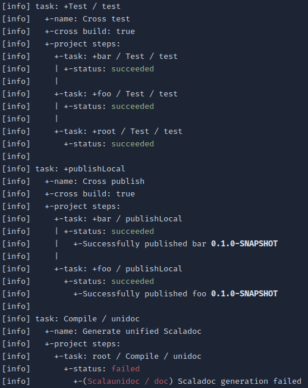

# sbt steps

Configure, run and share a list of tasks and commands to run in your sbt projects. Run the
steps from the sbt shell. Generate reports in HTML or in ASCII format. Use in GitHub
Actions or any other CI environment.

## Demo

Here are two report examples after running `ci` using `CIStepsPlugin`:

<table align=left>
  <tr>
    <td><b>HTML report</b></td>
  </tr>
  <tr valign=top>
    <td height=460>
      <p><code><b>sbt:root> ci/stepsStatusReport -</b></code></p>
      <sup>
        <table><tr height=30><td colspan=5 width=400>(<b><code>+Test / test</code></b>) Cross test</td></tr><tr height=30><td title="succeeded" width=40>:white_check_mark:</td><td colspan=2><code>+bar / Test / test</code></td></tr><tr height=30><td title="succeeded" width=40>:white_check_mark:</td><td colspan=2><code>+foo / Test / test</code></td></tr><tr height=30><td title="succeeded" width=40>:white_check_mark:</td><td colspan=2><code>+root / Test / test</code></td></tr><tr height=30><td colspan=5 width=400>(<b><code>+publishLocal</code></b>) Cross publish</td></tr><tr height=30><td title="succeeded" width=40>:white_check_mark:</td><td colspan=2><code>+bar / publishLocal</code></td></tr><tr height=30><td></td><td width=40>:green_circle:</td><td>Successfully published bar <code>0.1.0-SNAPSHOT</code></td></tr><tr height=30><td title="succeeded" width=40>:white_check_mark:</td><td colspan=2><code>+foo / publishLocal</code></td></tr><tr height=30><td></td><td width=40>:green_circle:</td><td>Successfully published foo <code>0.1.0-SNAPSHOT</code></td></tr><tr height=30><td title="skipped" width=40>:white_large_square:</td><td colspan=2><code>+root / publishLocal</code></td></tr><tr height=30><td></td><td width=40>:white_circle:</td><td><code>publishLocal / skip</code> is set to true</td></tr><tr height=30><td colspan=5 width=400>(<b><code>Compile / unidoc</code></b>) Generate unified Scaladoc</td></tr><tr height=30><td title="failed" width=40>:red_square:</td><td colspan=2><code>root / Compile / unidoc</code></td></tr><tr height=30><td></td><td width=40>:x:</td><td>(<code>Scalaunidoc / doc</code>) Scaladoc generation failed</td></tr></table>  
    </sup>
    </td>
  </tr>
</table>
<table align=left>
  <tr>
    <td><b>ASCII report</b></td>
  </tr>
  <tr valign=top>
    <td height=460>
      <p><code><b>sbt:root> ci/stepsTree --status</b></code></p>
      
    </td>
  </tr>
</table>
<br clear=left />

> [!NOTE]
> See the [demo scripted test] for the `build.sbt` of these examples. Run `sbt scripted
> sbt-steps/demo` to see the full demo.

[demo scripted test]: src/sbt-test/sbt-steps/demo/build.sbt

## Getting started

There are two ways to use this plugin: enable `CIStepsPlugin` or create your own
`StepsPlugin`. For first use it's recommended to start with `CIStepsPlugin`.

### Enable `CIStepsPlugin`

To quickly get started, first add the plugin to your `project/plugins.sbt`:

```sbt
addSbtPlugin("io.github.agboom" % "sbt-steps" % "<version>")
```

Then enable the `CIStepsPlugin` in your `build.sbt`:

```sbt
lazy val myProject = (project in file("."))
  .enablePlugins(CIStepsPlugin)
  .settings(
    name := "my-project",
  )
```

### Create your own `StepsPlugin`

See the [plugin development docs][create-steps-plugin].

[create-steps-plugin]: docs/plugin-development/#create-your-own-steps-plugin

## Usage

The `ci` task is central to `CIStepsPlugin`. It runs the configured `ci/steps` for all
subprojects in the build definition. All settings and tasks from `StepsPlugin`, like
`stepsTree` and `statusReport`, are scoped in this task.

### From the sbt shell

Run `ci` from an sbt shell (or `sbt ci` for batch mode). By default `+test` and `+publish`
are run. For the example project above, this results in the following steps sequence:

```
sbt:my-project> ci/stepsTree
[info] task: +Test / test
[info]   +-cross build: true
[info]   +-project steps:
[info]     +-task: +myProject / Test / test
[info] 
[info] task: +publish
[info]   +-cross build: true
[info]   +-project steps:
[info]     +-task: +myProject / publish
```

After `ci` has completed, run `ci/stepsTree --status` to print the steps tree with the
completed status. A status optionally has a message, such as:
```
[info] +- status: succeeded
[info]  +- Successfully published my-project `0.1.0-SNAPSHOT`.
```

A detailed HTML report is created during `ci` that you can use as a job summary in [GitHub
Actions](#use-with-github-actions) or any CI that accepts Markdown or HTML. By default the
report is written to `target/ci-status.html`. At any time you can also write a report to
file or stdout with `ci/statusReport`.

To include skipped steps and more information in the report, pass the `--verbose` or `-v`
flag, e.g. `ci -v` or `ci/stepsTree -v`.

For a complete list of available tasks and settings, execute `help ^steps.*` from your sbt
shell.

> [!IMPORTANT]
> Currently, a steps task like `ci` cannot be run for a specific subproject (e.g. don't run
> `sbt core/ci`). It uses all projects in the build regardless.

> [!NOTE] 
> In the commands above we have used `ci` as task scope, which is part of `CIStepsPlugin`.
> If you create your own `StepsPlugin` `ci` is replaced by a different task created for
> that steps plugin (e.g. `deploy` or `release`). All configurations, runs and reports are
> scoped to this task. This enables having multiple steps configurations for different use
> cases simultaneously. Read the [plugin developer documentation][create-steps-plugin] for
> more information.

### With GitHub Actions

Below is an example workflow for GitHub Actions:

```yml
name: CI
on:
  pull_request:
  push:
jobs:
  build:
    runs-on: ubuntu-latest
    steps:
      - uses: actions/checkout@v4
      - uses: actions/setup-java@v4
        with:
          distribution: temurin
          java-version: 17
          cache: sbt
      - uses: sbt/setup-sbt@v1
      - name: Build
        shell: bash
        run: sbt ci
      - name: Submit summary
        # try to create a summary on success or failure, but not on cancelled
        if: ${{ !cancelled() }}
        shell: bash
        run: |
          status_file=./target/ci-status.html
          if [ -f $status_file ]; then
            echo "# CI summary" >> $GITHUB_STEP_SUMMARY
            cat $status_file >> $GITHUB_STEP_SUMMARY
            echo >> $GITHUB_STEP_SUMMARY
            echo >> $GITHUB_STEP_SUMMARY
          else
            echo "Cannot create CI summary, because $status_file does not exist."
          fi
```

The workflow looks like any other sbt workflow, except instead of invoking sbt commands
directly, `sbt ci` is used. At runtime the steps tree is printed. In addition the CI steps
report is added to the [job summary]. If you have additional `StepsPlugin`s, you can
append their reports the same way.

[job summary]: https://docs.github.com/en/actions/writing-workflows/choosing-what-your-workflow-does/workflow-commands-for-github-actions#adding-a-job-summary

## Configuration

The configuration examples below use the `ci` task scope, but please note that `ci` can be
replaced by any other `StepsPlugin` task.

### Customize steps

By default, `CIStepsPlugin` sets `ci/steps` to run `+test` and `+publish`. This can be
customized as follows:

```sbt
lazy val foo = (project in file("foo"))
  .settings(
    ci / steps := Seq(
      Test / test,
      publish,
      Compile / unidoc,
    )
  )
lazy val bar = (project in file("."))
  .settings(
    ci / steps := Seq(
      Test / test,
      publish,
    )
  )
```

This configuration will result in the following steps sequence:

```
sbt:bar > ci/stepsTree
[info] task: Test / test
[info]   +-project steps:
[info]     +-task: foo / Test / test
[info]     +-task: bar / Test / test
[info] 
[info] task: publish
[info]   +-project steps:
[info]     +-task: foo / publish
[info]     +-task: bar / publish
[info] 
[info] task: Compile / unidoc
[info]   +-project steps:
[info]     +-task: foo / Compile / unidoc
```

> [!IMPORTANT]
> Task steps do not run for project aggregates configured by `aggregate()`. Instead, they
> are run for the subproject they are configured on. However, it's possible to run a task
> only for a specific subproject with [project filters](#set-project-filters-on-a-step).
> Sharing steps is done like any sbt setting, read the next section for more information.

> [!TIP]
> Because the `steps` setting is a list, they can also be appended (`ci/steps += Compile /
> unidoc`) or removed (`ci/steps -= publish`). Do always check the resulting
> `ci/stepsTree` after customizing.

> [!NOTE]
> Notice that the tree shows the steps in a different grouping than configured in the
> build definition. The tree shows the order in which the steps will actually be run.
> Project steps with the same step are grouped together, while the configured order is
> kept in tact. This mimics sbt aggregation and prevents steps to be run in an unexpected
> order. For example, in this build all test must succeed before continuing to publish. If
> you prefer per project grouping, use the [`stepsGrouping`
> setting](#change-the-steps-grouping).

### Share steps between subprojects

Use the `ThisBuild` scope (or use a shared setting) to share steps between subprojects.
For example:

```sbt
ThisBuild / ci / steps = Seq(
  Test / test,
  publish,
)

lazy val foo = (project in file("foo"))

lazy val root = (project in file("."))
```

This configuration will result in the following steps sequence:

```
sbt:root> ci/stepsTree
[info] task: Test / +test
[info]   +-project steps:
[info]     +-task: foo / Test / test
[info]     +-task: root / Test / test
[info] 
[info] task: +publish
[info]   +-project steps:
[info]     +-task: foo / publish
[info]     +-task: root / publish
```

> [!TIP]
> Sharing steps across builds is possible by [creating a plugin].

[creating a plugin]: docs/plugin-development/#share-steps-across-builds-with-a-plugin

> [!IMPORTANT]
> If you use an external plugin that declares shared `steps` on the project level, please
> note that the `ThisBuild` scope in your `build.sbt` will not work, because once enabled
> it's overwritten by the plugin setting. In that case a shared setting is needed: 
```sbt
lazy val sharedSettings = Def.settings(
  ci / steps := Seq(
    Test / test,
    publish,
  ),
)

lazy val foo = (project in file("foo"))
  .settings(sharedSettings)
```

### Declare steps for cross Scala versions

Any (input) task step can be run for the configured `crossScalaVersions` using the `+`
prefix. For example:

```sbt
inThisBuild(Seq(
  ci / steps := Seq(
    +(Test / test),
    +publish,
  ),
  crossScalaVersions := Seq("3.3.4", "2.13.15"),
))

lazy val foo = (project in file("foo"))

lazy val root = (project in file("."))
```

This configuration will result in the following steps sequence:

```
sbt:root> ci/stepsTree
[info] task: Test / +test
[info]   +-cross build: true
[info]   +-project steps:
[info]     +-task: +foo / Test / test
[info]     +-task: +root / Test / test
[info] 
[info] task: +publish
[info]   +-cross build: true
[info]   +-project steps:
[info]     +-task: +foo / publish
[info]     +-task: +root / publish
```

> [!NOTE]
> Cross build steps can be safely declared without setting `crossScalaVersions`, because
> `scalaVersion` is used by default.

> [!IMPORTANT] 
> For performance reasons, cross build steps mimic sbt cross build aggregation. This means
> that for each cross Scala version, all project tasks are run before going to the next
> cross Scala version. In the example above, this results the following order: `++ 3.3.4;
> root/test; foo/test; ++ 2.13.15; root/test; foo/test`. This behavior may lead to
> incomplete steps when its subsequent step has failed, which can be confusing. Even
> though this is the intended behavior, we may need to look into making this more clear.
> [This scripted test] can be used to test the performance limits.

[This scripted test]: src/sbt-test/sbt-steps-by-step/cross-source

### Use input task steps

The examples above only use task steps that run a [`Task`][sbt-task]. An input task step
is similar, except that it parses an input string before running the
[`InputTask`][sbt-input-task]. For example:

```sbt
lazy val foo = (project in file("."))
  .settings(
    ci / steps := Seq(
      (Test / testOnly) withInput "*MySpec",
    )
  )
```

If the input fails to parse, an error is shown in the step status when running `ci`.

### Use command steps

A command step runs an sbt [command][sbt-command]. Command steps are different from task
steps, because they behave exactly like commands executed from the sbt console. This means
that, unlike task steps, commands that run a task are also executed in project aggregates.
For this reason it's recommended to use command step only if there's no alternative task
step. To declare steps for multiple subprojects, use [`ThisBuild` or a shared
setting](#share-steps-between-subprojects).

However, command steps can be useful for running command aliases or actual commands. For
example:

```sbt
lazy val foo = (project in file("."))
  .enablePlugins(ScoverageSbtPlugin)
  .settings(
    ci / steps := Seq(
      "coverageOn",
      (Test / test),
      "coverageOff",
    )
  )
```

> [!TIP]
> Commands work well together with [project filters](#set-project-filters-on-a-step).

[sbt-task]: https://www.scala-sbt.org/1.x/docs/Tasks.html
[sbt-input-task]: https://www.scala-sbt.org/1.x/docs/Input-Tasks.html
[sbt-command]: https://www.scala-sbt.org/1.x/docs/Commands.html

### Skip a project step

To skip a task step, set `skip := true` like you would for any sbt task. For example:

```sbt
inThisBuild(Seq(
  ci / steps := Seq(
    +(Test / test),
    +publish,
  ),
  crossScalaVersions := Seq("3.3.4", "2.13.15"),
))

lazy val foo = (project in file("foo"))

lazy val root = (project in file("."))
  .settings(
    publish / skip := true,
  )
```

This configuration will result in the following steps sequence:

```
sbt:root> ci/stepsTree --verbose
[info] task: Test / +test
[info]   +-cross build: true
[info]   +-project steps:
[info]     +-task: +foo / Test / test
[info]     +-task: +root / Test / test
[info] 
[info] task: +publish
[info]   +-cross build: true
[info]   +-project steps:
[info]     +-task: +foo / publish
[info]     +-task: +root / publish
[info]       +-skipped: root / publish / skip is set to true
```

> [!NOTE]
> Command steps cannot be skipped with `skip := true`, so use project filters instead.
> Read further for more information.

### Set project filters on a step

Project filters allow you to declare a (shared) step, but only run it for a specific
subproject. Use the `forProject` combinator to achieve this. The default is `ThisProject`.
Project filters are especially useful for command steps. For example, the following steps
will run the `coverageOn` and `coverageOff` command for the root project only.

```sbt
ThisBuild / ci / steps := Seq(
  "coverageOn" forProject LocalRootProject,
  +(Test / test),
  "coverageOff" forProject LocalRootProject,
)

lazy val foo = (project in file("foo"))
  .enablePlugins(ScoverageSbtPlugin)

lazy val root = (project in file("."))
  .enablePlugins(ScoverageSbtPlugin)
```

This configuration will result in the following steps sequence:

```
sbt:root> ci/stepsTree
[info] command: coverageOn
[info]   +-project filter: LocalRootProject
[info]   +-project steps:
[info]     +-command: project root; coverageOn
[info] 
[info] task: Test / +test
[info]   +-cross build: true
[info]   +-project steps:
[info]     +-task: +foo / Test / test
[info]     +-task: +root / Test / test
[info] 
[info] command: coverageOff
[info]   +-project filter: LocalRootProject
[info]   +-project steps:
[info]     +-command: project root; coverageOff
```

Note the absence of `coverageOn` and `coverageOff` for project foo, because of the project filter.

### Declare a step to run only once

In some cases you want a step to be run only once in the entire build. To achieve this,
use the `.once` combinator. Its dual is `.whenever`. For example, the following steps will
run the `authenticate` task only once for the root project:

```sbt
ThisBuild / ci / steps := Seq(
  authenticate.once,
  +publish,
)

lazy val foo = (project in file("foo"))
  .settings(
    name := "foo",
  )

lazy val root = (project in file("."))
  .settings(
    name := "root",
  )
```

This configuration will result in the following steps sequence:

```
sbt:root> ci/stepsTree
[info] task: authenticate
[info]   +-run once: true
[info]   +-project filter: LocalRootProject
[info]   +-project steps:
[info]     +-task: authenticate
[info] 
[info] task: +publish
[info]   +-cross build: true
[info]   +-project steps:
[info]     +-task: foo / +publish
[info]     +-task: root / +publish
```

Note the added `+-run once: true` line in the steps tree.

### Continue to next step on error

If you have a step that is not critical to the complete success or want to continue in any
case, use the `.continueOnError` combinator on a step. Its dual is `.abortOnError`, which
is the default. For example:

```sbt
lazy val myLibrary = (project in file("."))
  .settings(
    ci / steps := Seq(
      +(Test / test).continueOnError,
      +publish,
    )
  )
```

The settings above will run `+test` for and proceed to `+publish` regardless of its
outcome.

> [!IMPORTANT]
> A failed step will always result in a failure status of the step and the entire run,
> whether `.continueOnError` is enabled or not.

## Advanced configuration

### Change the steps grouping

By default, steps are grouped by step to mimic sbt aggregation as explained in [this
section](#customize-steps). While this is a sensible default, there are use cases to keep
the by-project grouping. The grouping can be changed with the `stepsGrouping` setting:

```sbt
ThisBuild / ci / steps := Seq(
  +(Test / test),
  +publish,
)

Global / ci / stepsGrouping := StepsGrouping.ByProject

lazy val foo = (project in file("foo"))
  .settings(
    name := "foo",
  )

lazy val root = (project in file("."))
  .settings(
    name := "root",
  )
```

This configuration will result in the following steps sequence:

```
> ci/stepsTree
[info] project: root
[info]   +-task: Test / +test
[info]     +-cross build: true
[info]   +-task: +publish
[info]     +-cross build: true
[info]
[info] project: foo
[info]   +-task: +foo / Test / test
[info]     +-cross build: true
[info]   +-task: +foo / publish
[info]     +-cross build: true
```

> [!WARNING]
> If `+foo / Test / test` fails the foo project is not published, but the root project is.
> Only use this setting if you accept this behavior.

> [!CAUTION]
> `Global / stepsGrouping := StepsGrouping.ByProject` will set the grouping for all
> enabled steps plugins. It's recommended to set it per steps task scope, e.g. `Global /
> ci / stepsGrouping := StepsGrouping.ByProject`.

### Add custom result messages to the report

Result messages are shown in the report with a completed step or when you pass the `-s`
flag to `stepsTree`. You can add custom messages both to existing tasks or commands and to
new tasks, for example in a [custom steps plugin][create-steps-plugin]. Custom messages
are added with `MessageBuilder`s:

```sbt
Global / stepsMessagesForSuccess += TaskMessageBuilder.forSuccessSingle(Test / test) { _ => 
  CustomSuccessMessage("All tests passed!")
}
lazy val myLibrary = (project in file("."))
  .settings(
    ci / steps := Seq(
      Test / test,
    )
  )
```

This will result in the following steps report:

```
sbt:myLibrary> ci
...
sbt:myLibrary> ci/stepsTree -s
[info] task: Test / test
[info]   +-project steps:
[info]     +-task: myLibrary / Test / test
[info]       +-status: succeeded
[info]         +-All tests passed!
```

> [!NOTE]
> Always set these settings in the `Global` scope, e.g. `Global / ci /
> stepsMessagesForSuccess`. Otherwise it is unused and has no effect. Fortunately, sbt
> will warn you about this.

> [!IMPORTANT]
> Never reset `stepsMessagesFor...` with the `:=` operator. Always append with `+=` or
> `++=`, unless you want to lose the defaults.

> [!TIP]
> Custom message can be created in several ways. The above example shows the shorthand
> method. You can also create a separate case class. See the [plugin development
> documentation][create-steps-plugin] for an example.

## Acknowledgements

- [sbt-release](https://github.com/sbt/sbt-release) for the inspiration for this plugin
- [Simacan](https://github.com/simacan) where this plugin's development started
- [Pascal](https://github.com/steinerpascal) for providing valuable feedback before going public
